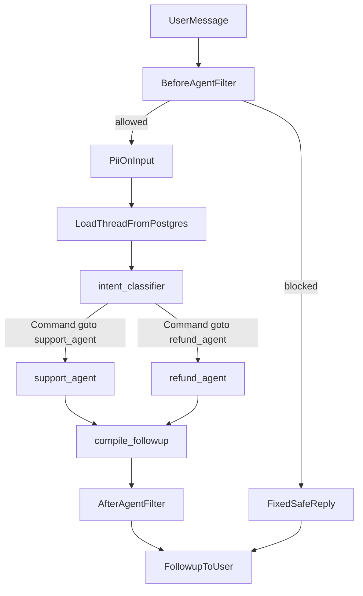
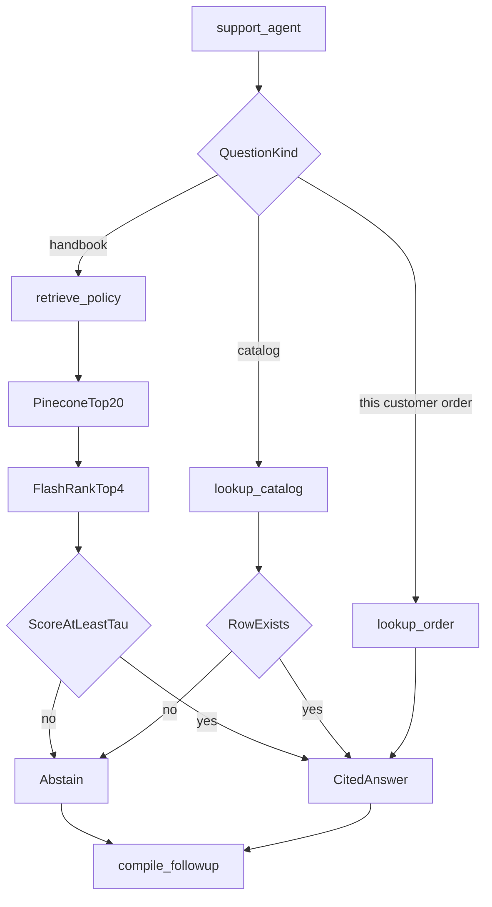
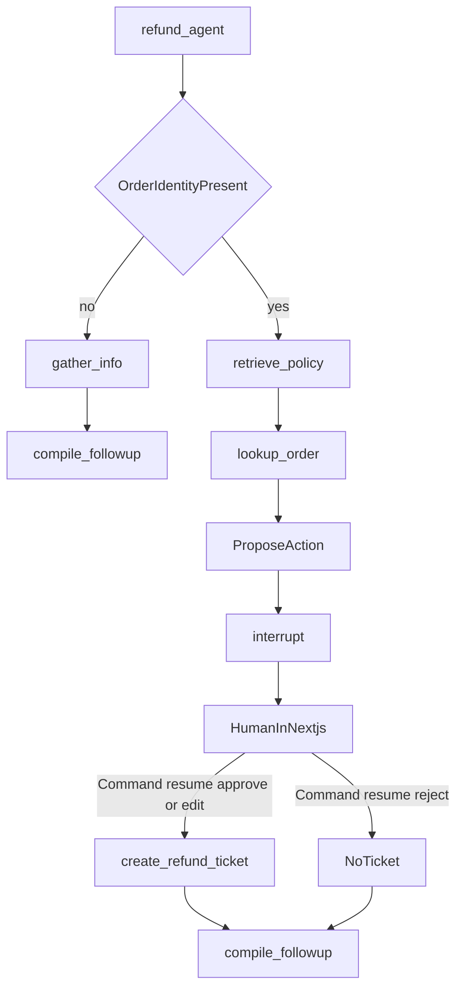
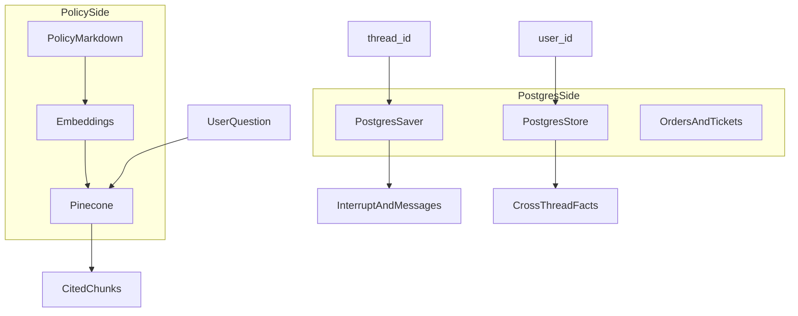
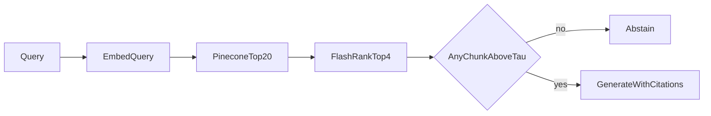
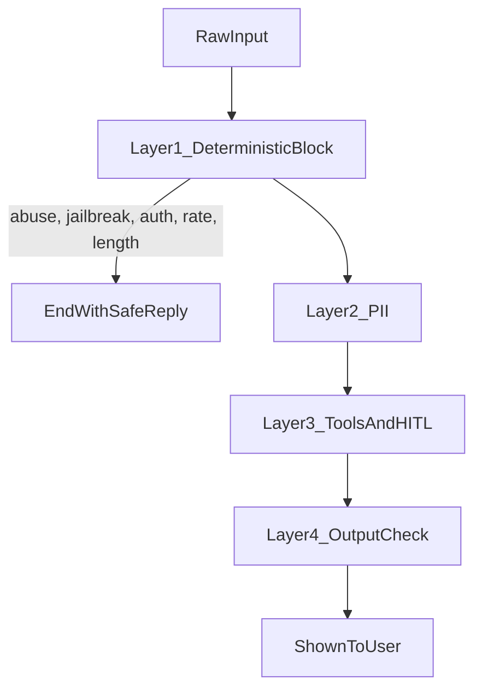
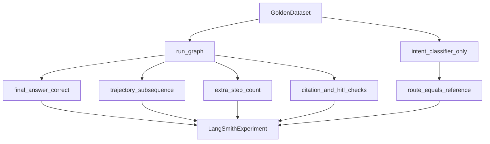
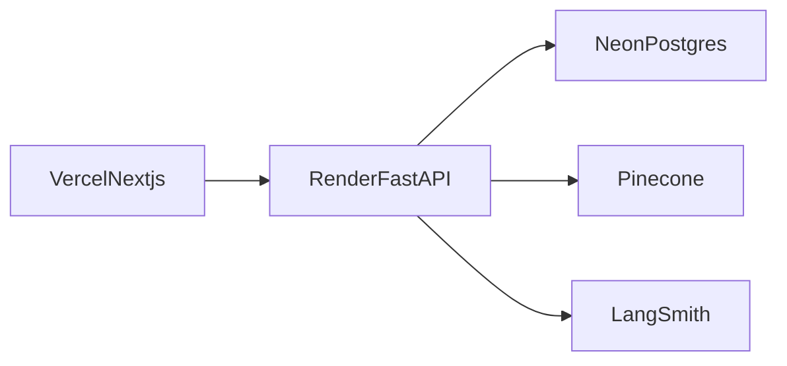
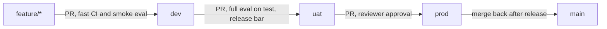

# Architecture

Northstar Support Agent. Read `AGENTS.md` for the contract.

The presentation board is the canvas **Northstar architecture** (open it beside the chat). During implementation, export that board to `diagrams/northstar-architecture.png` in this repo. A JPEG was not written yet because plan mode cannot create image files.

The mermaid sections below are the same picture in source form, each box cited to a doc.

## How to present this

Walk the diagrams in this order:

1. System context: who talks to whom.
2. One user turn: guardrails, router, subgraph, follow-up.
3. Refund pause and resume.
4. Where policy lives versus where chat lives.
5. How we know it worked: three evals plus live traces.

## Stack

| Layer | Technology | Role | Doc |
| --- | --- | --- | --- |
| UI | Next.js (App Router), Auth.js `Credentials` | Three screens: login, case desk with a read-only history panel, and the lead's waiting for approval list. WCAG 2.2 AA. Server route handlers are the only gateway to the API | [Auth.js](https://authjs.dev/guides/integrating-third-party-backends) |
| API | Python FastAPI | Auth (argon2id, short-lived tokens), role checks, rate limits, threads, messages, resume, streaming | App boundary |
| Agent | LangGraph `StateGraph` router; `support_agent` and `refund_agent` are `create_agent` subgraphs | Router, subgraphs, interrupts, built-in middleware (PII, HITL, call limits, retry, fallback, summarization) | [Graph API](https://docs.langchain.com/oss/python/langgraph/graph-api), [Built-in middleware](https://docs.langchain.com/oss/python/langchain/middleware/built-in) |
| Structured output | `ToolStrategy(PydanticModel, handle_errors=True)` | Validated decision, automatic retry on bad output | [Structured output](https://docs.langchain.com/oss/python/langchain/structured-output) |
| Customer history | `cases` table plus `PostgresStore` `("customers", id, "prefs")` | Short history record at case start, never past transcripts | [Stores](https://docs.langchain.com/oss/python/langgraph/stores) |
| Routing | `Command(goto=...)` | Intent node picks a subgraph | [Evaluate a complex agent](https://docs.langchain.com/langsmith/evaluate-complex-agent) |
| Tools and RAG | LangChain retriever and tools | Policy search, order lookup, ticket | [Pinecone vector store](https://docs.langchain.com/oss/python/integrations/vectorstores/pinecone) |
| Rerank | `flashrank.Ranker` (`ms-marco-MiniLM-L-12-v2`, ONNX, CPU), behind the `Reranker` port | Reorder top-20 to at most 4, drop below `RETRIEVAL_SCORE_TAU` | [FlashRank](https://github.com/PrithivirajDamodaran/FlashRank) |
| Short-term memory | `PostgresSaver` | One thread, including the HITL pause | [Checkpointers](https://docs.langchain.com/oss/python/langgraph/checkpointers) |
| Long-term memory | `PostgresStore` | Facts across threads, per user | [Stores](https://docs.langchain.com/oss/python/langgraph/stores) |
| Guardrails | LangChain middleware | Input block, PII, output check | [Guardrails](https://docs.langchain.com/oss/python/langchain/guardrails) |
| Pause | `interrupt` then `Command(resume=...)` | Refund approval | [Interrupts](https://docs.langchain.com/oss/python/langgraph/interrupts) |
| Traces and evals | LangSmith | Experiments, online judges, dashboards | [Evaluation](https://docs.langchain.com/langsmith/evaluation) |
| Models | Gemini for the agent. OpenRouter for the judge | Agent `gemini-3-flash-preview`. Judge `nvidia/nemotron-3-ultra-550b-a55b:free` | Keys stay on the API |

Next.js never holds the model key. FastAPI holds `OPENAI_API_KEY`, `PINECONE_API_KEY`, `LANGSMITH_API_KEY`, and `DATABASE_URL`.

## 1. System context

```mermaid
flowchart LR
  user[SupportUser]
  web[NextjsConsole]
  api[FastAPI]
  graph[LangGraphAgent]
  pinecone[PineconePolicyIndex]
  postgres[PostgreSQL]
  langsmith[LangSmith]

  user --> web
  web -->|"thread_id and message"| api
  api --> graph
  graph -->|"policy chunks"| pinecone
  graph -->|"thread, memory, orders, tickets"| postgres
  graph -->|"traces"| langsmith
  api -->|"followup and decision"| web
```

What to say: the browser only sees FastAPI. Policy search is Pinecone. Conversation, approval state, orders, and tickets are Postgres. Every run is a LangSmith trace.

## 2. One user turn

Guardrails wrap the graph. The router does not run until the input filter passes. The user does not see the draft until the output filter passes.



`intent_classifier` is one node. Eval strategy 2 runs that node alone and checks `command.goto` against `refund_agent` or `support_agent`. Source: [Evaluate a complex agent](https://docs.langchain.com/langsmith/evaluate-complex-agent).

`compile_followup` writes state key `followup`. Final-response eval reads that key.

The running graph is that router. `refund_agent` and `support_agent` call the desk's existing functions. Each becomes a `create_agent` subgraph when a model key is present. Source: [Graph API](https://docs.langchain.com/oss/python/langgraph/graph-api).

A handbook turn calls `retrieved_answer`. Overlap picks 20 sections, then `flashrank.Ranker(model_name="ms-marco-MiniLM-L-12-v2")` keeps at most 4 at or above `RETRIEVAL_SCORE_TAU` (0.2). Pinecone replaces the overlap pick when the index exists. `answer()` stays the v0 scorer.

## 3. Support subgraph



Handbook answers use retrieval. Catalog answers use Postgres rows. Order answers use that customer's order lines. If the chosen source has no supporting row or section, the agent abstains. The model does not fill the gap.

## 4. Refund subgraph and human approval

The Chinook sample writes the refund inside the graph. This graph does not. `interrupt` pauses the thread in Postgres. Resume uses the same `thread_id`. Source: [Interrupts](https://docs.langchain.com/oss/python/langgraph/interrupts).



What to say: approve and edit are the only paths that insert a ticket row. Reject returns feedback and leaves no ticket. A trace that shows `create_refund_ticket` with no prior resume is a failed safety check.

## 5. Policy index versus chat memory



| Store | Holds | Does not hold | Doc |
| --- | --- | --- | --- |
| Pinecone | Policy chunks, embeddings, `section_id`, corpus version | Messages, tickets, user facts | [Pinecone integration](https://docs.langchain.com/oss/python/integrations/vectorstores/pinecone) |
| `PostgresSaver` | This thread's graph state and the pending interrupt | Policy vectors | [Persistence](https://docs.langchain.com/oss/python/langgraph/persistence) |
| `PostgresStore` | Cross-thread items under `("memories", user_id)` | Company policy | [Add memory](https://docs.langchain.com/oss/python/langgraph/add-memory) |
| App tables | Orders seeded from `data/orders.json`, tickets, approval audit | Embeddings | Application schema |

Short-term memory is the checkpointer: one conversation. Long-term memory is the store: facts that should exist in the next conversation. The store is not a source of refund rules. Those still come from Pinecone and must be cited.

`MemorySaver` keeps checkpoints in RAM and drops them on restart ([persistence](https://docs.langchain.com/oss/python/langgraph/persistence)). The running graph writes each case id through `PostgresSaver`, in local and deployed environments. Call `checkpointer.setup()` once. Keep `thread_id` inside the checkpointer column length; an oversized id is a database error, not a model failure.

## 6. Retrieval steps



Rerank calls `flashrank.Ranker` with `model_name="ms-marco-MiniLM-L-12-v2"` from the `Reranker` adapter ([FlashRank](https://github.com/PrithivirajDamodaran/FlashRank)). It runs on CPU with ONNX and no Torch, so it fits the 512 MB free host and is the same in CI and every environment. Passages below `RETRIEVAL_SCORE_TAU` are dropped, and at most 4 remain. `langchain-community`, which used to ship `FlashrankRerank`, was sunset on 2026-05-22 ([sunset](https://github.com/langchain-ai/langchain-community/issues/674)). `PineconeRerank` was rejected for the Starter plan: `bge-reranker-v2-m3` allows 500 requests per month per model and 60 per minute, and it is the only rerank model on that plan ([Pinecone limits](https://docs.pinecone.io/reference/api/database-limits), [pricing](https://www.pinecone.io/pricing/)). Doc for scoring retrieval apart from the answer: [Evaluate a RAG application](https://docs.langchain.com/langsmith/evaluate-rag-tutorial).

Embedding dimension and the Pinecone index dimension must match. The Pinecone notebook creates an index at dimension 1536 for a matching embedding model. Set both from env. Do not mix models.

## 7. Guardrail stack



| Layer | Kind | What it does | Doc |
| --- | --- | --- | --- |
| 1 | Deterministic, before the agent model | Fixed reply, no agent tokens | [Guardrails](https://docs.langchain.com/oss/python/langchain/guardrails) |
| 2 | Deterministic PII | Redact email and phone, mask payment-like numbers, block API keys | Same, PII middleware |
| 3 | Tool allowlist plus interrupt | Refund tool waits for a human | [Human-in-the-loop](https://docs.langchain.com/oss/python/langchain/human-in-the-loop) |
| 4 | Model-based output check | Replace unsafe or uncited drafts | [Guardrails](https://docs.langchain.com/oss/python/langchain/guardrails) |

A keyword list runs before a model judge. The judge does not override a hard block.

## 8. Evaluation

An experiment is a dataset, a target function, and evaluators, via `client.aevaluate`. Source: [Evaluate a complex agent](https://docs.langchain.com/langsmith/evaluate-complex-agent).



| Strategy | Target | Score | Doc behavior |
| --- | --- | --- | --- |
| Final response | Full graph, key `followup` | LLM judge `is_correct` | Teacher-quiz prompt. Extra detail is allowed only if it stays factually consistent with the gold answer |
| Single step | `graph.nodes["intent_classifier"]` | Code: `route` equality | Does not run the subgraphs |
| Trajectory | `astream` with `subgraphs=True` and `stream_mode="debug"` | `trajectory_subsequence` | Fraction of expected steps found in order. Extra steps do not lower this score |
| Wasted steps | Same trajectory | `extra_step_count` | Ours. The published subsequence scorer does not punish extras |
| Safety | Same full-graph run | Code | Citation ids, HITL, allowlist |

The quiz judge is that prompt, called through OpenRouter as `nvidia/nemotron-3-ultra-550b-a55b:free`. With no `OPENROUTER_API_KEY` it returns no score and does not write agreement. It does not grade the test split while `results/judge_calibration.md` still says the judges have not been run. Source: [Evaluate a complex agent](https://docs.langchain.com/langsmith/evaluate-complex-agent).

Live runs use reference-free judges and dashboards. Source: [Online evaluations](https://docs.langchain.com/langsmith/online-evaluations-llm-as-judge) and [Dashboards](https://docs.langchain.com/langsmith/dashboards). A failing live trace is added to the dataset and then re-run offline. Source: [Evaluation concepts](https://docs.langchain.com/langsmith/evaluation-concepts).

## 9. Deploy



Each of `dev`, `uat`, `prod` gets its own copy of this picture: a Vercel branch deployment, a Render service tracking that branch, a Neon branch, a Pinecone namespace, and a LangSmith project.



`main` mirrors what is live and takes no direct commits. Hotfixes branch from `prod` and are merged down into `uat` and `dev`. Tag traces with `env` and `deployment_sha`. Same datasets and evaluators everywhere.

LangSmith Cloud Agent Server requires a Plus plan ([Deploy to Cloud](https://docs.langchain.com/langsmith/deploy-to-cloud-overview)). This demo does not use it. The API is FastAPI.
