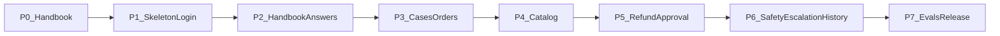

# Slice 1 build phases

Status: planned, not started.

Source of scope: `prd.md`, P0 and R1 to R33. Implementation spec: `docs/spec.md`. How each part is built: `AGENTS.md`. Any feature not in the PRD is out of scope until it's added there first.

## Rules for every phase

- **Vertical slice.** Every phase ships one complete path: UI, API, agent or domain logic, data, traces, and that phase's labeled cases. It is deployed to `dev` through a `feature/*` branch and a PR.
- **Done means:**
  - every requirement id listed for the phase passes its acceptance check;
  - its labeled cases pass;
  - the traces are visible in `northstar-dev`;
  - `architecture.md`, `explanation.md`, and `correction.md` are updated.
- **Doc first.** Before any technical decision, open the matching LangChain, LangGraph or LangSmith doc and cite it.
- **Deep modules.** Each module has a small interface that hides a lot of logic. Graph nodes and API routes only call these interfaces. SDKs are imported only in adapters.

## Deep modules

| Module | Public interface | What it hides |
| --- | --- | --- |
| `identity` | `login`, `refresh`, `logout`, `current_staff(token)` | argon2id hashing, token signing, refresh rotation, lockout, audit |
| `cases` | `open_case`, `bind_customer`, `resolve`, `escalate`, `history(customer)` | status rules, read-only enforcement, saving the draft and final text |
| `handbook` | `answer(question) -> CitedAnswer or Abstain` | embedding, Pinecone search, FlashRank rerank, score gate, citation check against `SECTION_IDS.md` |
| `catalog` | `lookup(query) -> rows or Abstain` | Postgres catalog query, enforcing row fields only |
| `orders` | `get_for_customer(case, order_id) -> OrderView or NotFoundForCustomer` | customer scoping, the unbound-case refusal, refunded lines |
| `approvals` | `propose(case, proposal)`, `pending()`, `decide(lead, id, decision)` | LangGraph interrupt and resume, the proposer cannot approve, idempotent tickets, stale flag, audit |
| `guard` | `screen_input`, `screen_output` | deterministic blocks, PII middleware, moderation, fixed safe replies |
| `usage` | `check_and_charge(staff, tokens)` | request limits, the daily token quota, the message shown when a limit is hit |
| `evals` | `registry`, `run(split)` | code graders, openevals judges, rate limiter, LangSmith experiments |

## Phases

**Phase 0: Handbook v2.** See `phase-0-handbook-v2.md`. Writes every handbook section, the `SECTION_IDS.md` registry, and the conflict checks. No code.

**Phase 1: Walking skeleton plus login.** R24, R25, R27.
- Repo layout: `apps/web` (Next.js), `apps/api` (FastAPI), `packages/agent`, `evals`.
- Locked dependencies. Branches `main`, `dev`, `uat`, `prod`.
- Neon branches, Render and Vercel `dev` deployments.
- `identity` module, seeded staff accounts (specialist and lead), Auth.js Credentials, server-side route handlers, security headers, login lockout.
- An empty case desk that is reachable only after login.
- CI: lint (including `jsx-a11y`), unit tests, `pip-audit` and `npm audit`.
- R32 starts here: palette tokens checked for contrast, focus styles, accessible login. Every later phase keeps its screens accessible; Phase 7 gates it with an axe scan.

**Phase 2: Handbook answers with citations.** R1, R2, R11 (draft, rationale, citations), R26.
- Ingest the handbook into Pinecone `handbook-dev`.
- `handbook` module. Router plus `support_agent` (`create_agent`) answering handbook questions.
- Streamed step progress, then the checked draft. Trust display shows the sections and match strength.
- `usage` module for request limits and the daily token quota.
- Labeled cases: handbook answers and abstains.
- Eval harness: citation checks, retrieval recall, hit rate and MRR, the groundedness judge.

**Phase 3: Cases, customer binding, orders.** R3, R14, R29, R30, R31, R10.
- `cases` module: customer lookup by email or phone, unbound cases, status rules (Open, Resolved), saving the draft and final text.
- `orders` module and the `lookup_order` tool. Postgres checkpointer so a case survives restarts.
- Seed synthetic customers and orders.
- Labeled cases: order status, an order owned by someone else, an unbound case, an unknown order id.

**Phase 4: Catalog answers.** R21.
- `catalog` module and the `lookup_catalog` tool. Seed catalog rows for the four categories.
- Labeled cases: an item that exists, an unknown item, a field the row doesn't have (abstain).

**Phase 5: Refund proposal and lead approval.** R4, R5, R6, R7, R10, R22, R23, R28.
- `refund_agent` (`create_agent` with `HumanInTheLoopMiddleware`) and the `approvals` module.
- Waiting for approval status. Lead-only approve, edit and reject; the proposer cannot approve. Idempotent tickets. 24-hour stale flag. The waiting-for-approval list.
- Labeled cases: in window, out of window, used item (50% store credit), damaged, final sale, already refunded, missing order id, approve, edit, and reject resumes.
- Trajectory evals and the single-step router eval.

**Phase 6: Safety, escalation, customer history.** R8, R9, R33. Escalation, the customer-history P0 feature, and the read-only history panel on the case desk.
- `guard` module: input block, PII, output check, fixed safe reply.
- Escalation with a short handoff and the Escalated status.
- History record built from app tables when a case opens.
- Labeled cases: slurs, jailbreaks, legal or chargeback language, PII in the message, a duplicate refund stopped by history.

**Phase 7: Evals, release, submission.** R12, R32 gate (axe scan of the three screens on the PR into `uat`), and every remaining release-bar gate.
- Complete the roughly 40-case set (10 train_judge, 15 dev, 15 test). Calibrate the judges on train_judge.
- Run v0 (naive prompt) and v1 (policy-first) with `num_repetitions=3`. Pairwise comparison of v0 against v1. Pin a baseline experiment.
- Online evaluators: 10% sampled, plus every run that abstained, escalated or was edited. Dashboards.
- Promote `dev` to `uat` (release bar gate) and then to `prod`. Merge back into `main`.
- Export the architecture image (PNG and JPEG), write the README, and record the screen recording.

## Requirement coverage check

Every P0 requirement id appears in exactly one phase above. A phase may not add behavior that isn't tied to a requirement id or a P0 feature line in the PRD.

## Tasks

- [ ] Phase 0: handbook v2 and SECTION_IDS registry
- [ ] Phase 1: repo, branches, Neon/Render/Vercel dev, identity, Auth.js login, lockout, headers, CI (R24, R25, R27)
- [ ] Phase 2: ingest, handbook module, router + support_agent, streamed steps, trust display, usage limits, eval harness (R1, R2, R11, R26)
- [ ] Phase 3: cases, customer binding, unbound cases, orders, Postgres checkpointer, seed data (R3, R10, R14, R29, R30, R31)
- [ ] Phase 4: catalog module and tool, seed catalog (R21)
- [ ] Phase 5: refund_agent with HITL, approvals, lead-only decisions, idempotent tickets, stale flag, waiting list, trajectory evals (R4-R7, R22, R23, R28)
- [ ] Phase 6: guard, escalation with handoff, customer history (R8, R9)
- [ ] Phase 7: full labeled set, judge calibration, v0 vs v1, pairwise, baseline, online evals, uat/prod promotion, diagram image, README, recording (R12)
